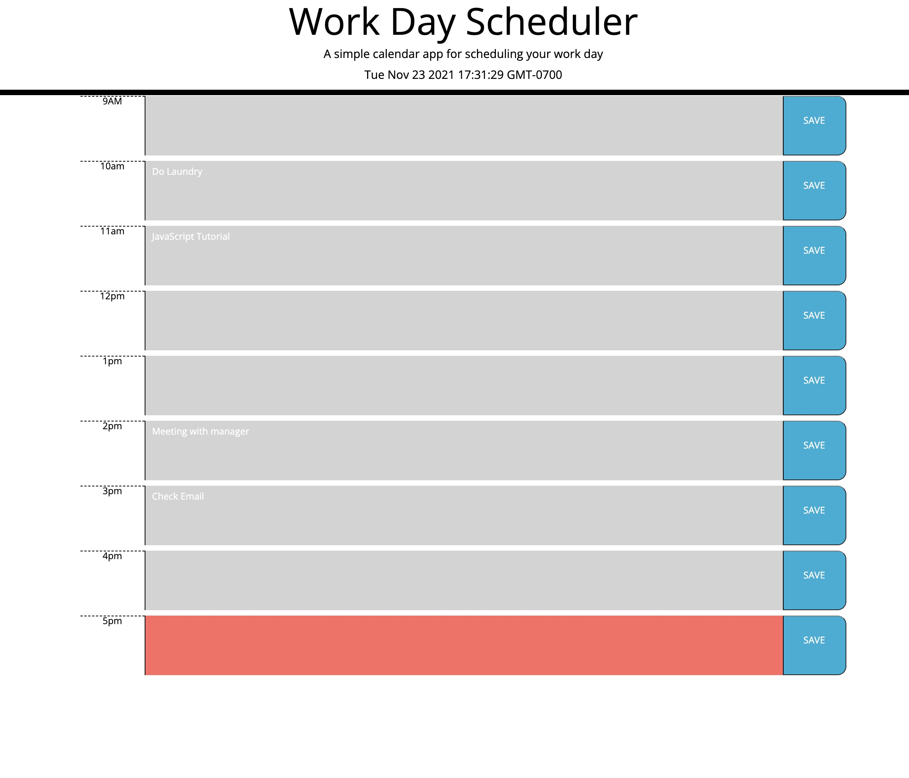

 </a>

<h1 align="center">Day Planner</h1>

---

## 🧠About 

In this project I created a day planner that shows a schedule from 9am to 5pm. There are text boxes where users can enter in to-do items and to the right of each text/time block there is a save feature that saves it to local storage. In addition to this, the times that are in the past, present, and future all have different color codes. The current date is also displayed at the top of the page.

## 🈠Usage 

Enter in your schedule for the day and click save to create your day plan.

## 🚀 Deployment 

Deployed this website using GitHub pages. In order to do this I went to settings, scrolled down to GitHub pages, and selected the "master branch".

## ⛏️ Built Using 

- # HTML
- # CSS
- # JS
- # Moment
- # Bootstrap

## 🔗 Link to deployed website

- https://mattgrogandev.github.io/day-planner/

## 🖼️ Image of final website

